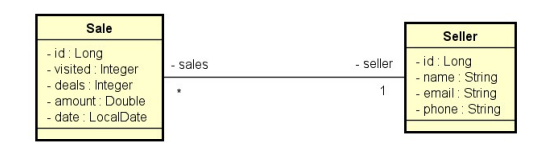

# Desafio: Consulta vendas (Relatório e Sumário)

## Sobre o Projeto
Este projeto foi desenvolvido como resolução do desafio do curso **Formação Desenvolvedor Moderno** da **DevSuperior**, módulo **Back end**, capítulo **JPA, consultas SQL e JPQL**.

O objetivo do desafio é implementar consultas em um sistema de vendas usando **Spring Boot + Spring Data JPA**, contemplando filtros opcionais por período e vendedor.

---

## Modelo de Domínio

## Especificação - Sistema de Vendas
O sistema é composto por **Vendas (Sale)** e **Vendedores (Seller)**:

- Cada **venda** pertence a **um vendedor**
- Um **vendedor** pode possuir **várias vendas**

O desafio pede a implementação de duas consultas principais:

1. **Relatório de vendas**
2. **Sumário de vendas por vendedor**

---

## Consultas Implementadas

### ✅ 1) Relatório de vendas
#### Entrada (IN)
O usuário informa, opcionalmente:
- `minDate` (data inicial)
- `maxDate` (data final)
- `name` (trecho do nome do vendedor)

#### Saída (OUT)
O sistema retorna uma **listagem paginada** contendo:
- `id`
- `date`
- `amount`
- `sellerName`

## Tecnologias Utilizadas
- Java
- Spring Boot
- Spring Data JPA
- JPA/Hibernate
- Maven
- H2 Database
- SQL / JPQL